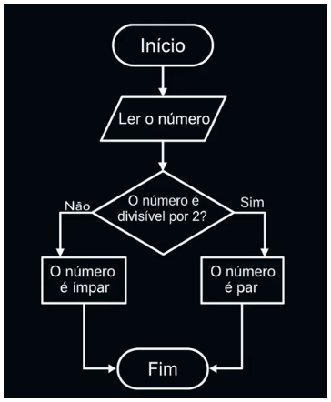

# Introdução ao Pensamento Computacional
**Definição**: Habilidade de resolver problemas de maneira lógica, passo a passo, como se estivesse instruindo um computador.
**Objetivo**: Transformar ideias e demandas do dia a dia em soluções por meio de software.
## Funcionamento do Computador
**Operações Básicas**: O computador realiza operações lógico-aritméticas.
**Construção de Software**: Instruir o computador sobre como interagir com o usuário.
## Exemplos do Pensamento Computacional
1. **Fazer um Bolo:**
    Importância de seguir um passo a passo.
    Verificações necessárias durante o processo (ex: temperatura do forno).

2. Montagem de Móveis:
    Seguir instruções para garantir a estrutura e funcionalidade.

## Ciclo de Funcionamento de um Sistema Web
**Entrada**: Interação do usuário com a aplicação.
**Processamento**: O software processa a entrada conforme regras de negócio.
**Saída**: Resultado gerado para o usuário.

## Compreensão do Problema
**Entendimento** Inicial: Antes de escrever instruções, é crucial entender o problema a ser resolvido.
**Exemplo**: Desenvolvimento de um editor de texto requer identificar funcionalidades específicas.

## Aplicação do Pensamento Computacional em Diversas Áreas
**Medicina**: Triagem de sintomas para diagnóstico.
**Arquitetura**: Compreensão da demanda do cliente para projetos.
**Logística**: Organização de rotas de entrega considerando variáveis como distância e tempo.

## Implementação de Soluções
**Reconhecimento de Padrões**: Identificar padrões para otimizar processos (ex: rotas de entrega).
**Decomposição do Problema**: Dividir problemas complexos em componentes gerenciáveis.

## Integração de Capacidades Produtivas
**Trabalho em Equipe**: Importância da comunicação em um time multidisciplinar para a construção de software.
**Objetivo Comum**: Garantir que todos os componentes funcionem em conjunto.

# Decompondo Problemas

## Introdução ao Pensamento Computacional
- O pensamento computacional é uma abordagem que pode ser aplicada em diversas áreas, não apenas na programação.
- A decomposição de problemas é o primeiro passo para entender e resolver demandas complexas.

## Decomposição de Problemas
- **Definição**: Dividir um problema grande em partes menores e mais gerenciáveis.
- **Importância**:
  - Melhora a comunicação entre os membros da equipe.
  - Proporciona clareza na solução de problemas.
  
## Exemplos de Decomposição
- **Editor de Texto**:
  - Pode ser simples (bloco de notas) ou complexo (Word).
  - Decomposição em tarefas menores, como:
    - Mudança de cor da fonte (front-end).
    - Formatação de texto (back-end).
  
- **Faxina em Casa**:
  - Dividir a tarefa em partes menores (banheiro, quarto, armário).
  - Planejar a execução em dias diferentes para evitar sobrecarga.

## Planejamento da Rotina de Estudos
- Identificar horários disponíveis para estudo.
- Definir prioridades e metas de aprendizagem.
- Criar um cronograma factível, estabelecendo metas de curto e longo prazo.

## Decomposição em Desenvolvimento de Software
- Exemplo prático: Criar uma funcionalidade de login.
  - Identificar dados necessários para o login.
  - Planejar a verificação dos dados e o tratamento de erros.
  
## Aproveitando Soluções Existentes
- Reaproveitar soluções já disponíveis na comunidade (bibliotecas, frameworks).
- Evitar retrabalho e acelerar o desenvolvimento.

## Conclusão
- A decomposição de problemas é essencial para transformar demandas brutas em soluções claras e gerenciáveis.
- A prática do pensamento computacional pode ser aplicada em diversas situações do dia a dia e no desenvolvimento de software.

# Reconhecimento de Padrões

## 1. Introdução ao Reconhecimento de Padrões
- **Definição**: Identificar semelhanças entre diferentes partes de um problema.
- **Importância**: Permite a automação de processos e ganho de produtividade.

## 2. Exemplo Prático: Setor de Atendimento ao Cliente
- Questões repetitivas são comuns.
- **Solução**: Criar um banco de respostas para questões frequentes.
- **Benefício**: Automatização do atendimento, poupando recursos.

## 3. Implementação de Soluções Automatizadas
- Exemplo: Chatbots que triagem questões simples.
- **Objetivo**: Ajudar usuários a resolver problemas sem intervenção humana.

## 4. Reutilização de Soluções no Desenvolvimento de Software
- Funcionalidades frequentemente seguem lógicas semelhantes.
- **Prática**: Reutilizar ou adaptar soluções existentes para aumentar a produtividade.

## 5. Criando Websites com Padrões Reutilizáveis
- Dividir o problema de criação de um website em partes menores.
- **Exemplo**: Utilização de templates e ferramentas como Google Sites para facilitar a construção.

## 6. Aplicação de Conhecimentos Prévios
- Decomposição do problema e reconhecimento de padrões.
- **Objetivo**: Aplicar experiências anteriores para encontrar soluções mais eficazes.

## 7. Conclusão
- O reconhecimento de padrões é uma habilidade essencial para resolver problemas de forma eficiente e produtiva.

# Aula: Explorando o Pensamento Computacional

## 1. Decomposição e Reconhecimento de Padrões
- **Decomposição**: Dividir um problema grande em partes menores.
- **Reconhecimento de Padrões**: Identificar semelhanças entre as partes ou entre partes e soluções existentes.
  - Exemplo: Diagnóstico clínico ou solução de vazamento em casa.

## 2. Abstração no Transporte Urbano
- **Abstração**: Ocultar detalhes irrelevantes e focar no essencial.
  - Exemplo: Mapa de transporte metropolitano que destaca linhas e estações, mas não inclui ruas.
  - Facilita a locomoção em grandes cidades.

## 3. Aplicando a Abstração no Cotidiano e no Software
- **Fazer Café**: Processo simplificado que ignora detalhes complexos.
- **No Software**: Abstraímos funcionalidades para focar na construção de sistemas.
  - Linguagens de programação fazem abstrações para facilitar a implementação.

## 4. Abstração em Aplicações Web e Hardware
- **Botão de Enviar**: Usado em diferentes contextos, mas com uma funcionalidade básica comum.
- **Gerenciamento de Hardware**: O sistema operacional abstrai o funcionamento dos circuitos eletrônicos, permitindo uso simples de múltiplas aplicações.

## 5. Abstração em Ambientes de Nuvem
- Permite que a mesma infraestrutura execute múltiplas aplicações e armazene vários websites simultaneamente.

## Conclusão
- A abstração é uma ferramenta essencial no dia a dia e no mundo da computação, facilitando a organização e a criação de sistemas complexos.

# Algoritmos

## Definição de Algoritmo
- Um **algoritmo** é uma sequência finita de instruções para resolver um problema específico.
- Cada algoritmo deve ter:
  - **Início**: Uma instrução inicial que dá início ao processo.
  - **Meio**: Instruções intermediárias que detalham as etapas a serem seguidas.
  - **Fim**: A instrução final que resulta na solução do problema.

## Características dos Algoritmos
- **Clareza**: Cada passo deve ser claro e compreensível.
- **Objetividade**: As instruções devem ser diretas e sem ambiguidades.
- **Executabilidade**: Os passos devem ser executáveis por uma máquina ou pessoa, sem deixar dúvidas.

## Comparação com Receitas Culinárias
- Algoritmos podem ser comparados a **receitas de bolo**:
  - Sequência ordenada de passos que devem ser seguidos na ordem correta.
  - Instruções devem ser precisas, como "assar por 40 minutos a 200 graus Celsius".
  - Inclusão de condicionais para garantir que o resultado seja consistente, independentemente das variáveis externas.

## Aplicação Prática
- Exemplo prático: Desenvolvimento de uma máquina de café.
  - O algoritmo deve incluir instruções sobre como ajustar a temperatura da água e o movimento sobre o pó.
  - Permitir ao usuário dosar a quantidade de xícaras desejadas.

## Importância dos Algoritmos
- Algoritmos são fundamentais para transformar ideias de solução em instruções que podem ser compreendidas e executadas por máquinas.
- Eles são a base para muitas funcionalidades em aplicativos web e móveis, onde sequências de instruções são executadas a partir de interações do usuário.

# Resolução de problemas com algoritmos

## Explorando os fundamentos do pensamento computacional

1. **Decomposição de Problemas**: Dividir um problema em partes menores.
2. **Reconhecimento de Padrões**: Aplicar conhecimentos prévios e soluções existentes.
3. **Abstração**: Focar apenas no que é essencial.
4. **Elaboração de Algoritmos**: Criar sequências de passos lógicas e precisas para resolver problemas.

## Exemplo Prático: Fazer Café Coado

- **Objetivo**: Criar um tutorial para preparar café coado.
- **Passos**:
  1. Pegar utensílios: filtro de papel, suporte e garrafa térmica.
  2. Posicionar o filtro no suporte e o suporte sobre a garrafa.
  3. Adicionar pó de café (1 colher por xícara de água).
  4. Aquecer água até quase ferver.
  5. Umedecer o pó com um pouco de água.
  6. Derramar o restante da água em movimentos circulares.
  7. Aguardar a filtragem e servir o café.

## Cálculo da Média Aritmética

- **Objetivo**: Calcular a média de quatro notas.
- **Passos**:
  1. Obter as quatro notas.
  2. Somar as notas.
  3. Dividir a soma por 4.
  4. Mostrar ou salvar o resultado.

## Problema dos Missionários e Canibais

- **Objetivo**: Atravessar um rio com 3 missionários e 3 canibais, respeitando regras de segurança.
- **Regras**:
  - O número de canibais não pode ser maior que o número de missionários em nenhuma margem.
  - O barco comporta apenas 2 pessoas.

### Representação de Estados

- Estado inicial: `3M, 3C | 0M, 0C`
- Exemplo de travessias:
  1. `3M, 1C | 0M, 2C` (2 canibais atravessam)
  2. `3M, 2C | 0M, 1C` (1 canibal volta)
  3. `3M, 0C | 0M, 3C` (2 canibais atravessam)
  4. E assim por diante até completar a travessia.

## Reflexão sobre a Complexidade dos Algoritmos

- O pensamento computacional ajuda a transformar tarefas complexas em sequências lógicas de passos simples.
- A travessia dos missionários e canibais é um exemplo de como estruturar algoritmos para resolver problemas complexos.

# Representação de Algoritmos

## Analisando a Estrutura dos Algoritmos

- **Objetivo**: Organizar algoritmos que sejam interpretáveis e executáveis por máquinas.
- **Importância da Clareza**: Instruções devem ser precisas para evitar dúvidas na execução.

### Identificando Problemas na Descrição do Algoritmo

- Exemplos de incertezas:
  - O que significa "quase ferver"?
  - Quando é o fim da filtragem?
  - Tamanho da xícara e tipo de colher não especificados.

### Estruturando o Algoritmo do Café Coado
```
// Início do algoritmo
Início

    // Preparar utensílios
    pegar(filtro de papel, suporte, garrafa)

    // Colocar o filtro e posicionar o suporte
    colocar(filtro de papel, suporte)
    posicionar(suporte, garrafa)

    // Adicionar o pó de café
    quantidade = número de xícaras * colher
    adicionar(pó de café, quantidade, filtro de papel)

    // Aquecer a água
    colocar(água, bule)
    aquecer(bule, 90ºC)

    // Umedecer o pó de café
    derramar(água, modo, vazão, filtro de papel)

    // Filtragem principal
    derramar(água, modo, vazão, filtro de papel)

    // Finalização
    aguardar(água, filtro de papel)
    servir(café, garrafa)

// Fim do algoritmo
Fim
```
### Compreendendo a Base da Estrutura de um Algoritmo

- **Sequência**: Passos executados um após o outro, sem desvios.
- **Linear e Sequencial**: Instruções seguidas em ordem, com decisões limitadas.

### Características dos Algoritmos

- **Interpretável e Executável**: Escrito em pseudocódigo para facilitar a compreensão.
- **Entradas e Parâmetros**: Exemplo: tamanho da colher, modo de derramar, vazão.
- **Modularidade**: Organização em blocos facilita ajustes.

### Avançando na Organização Lógica de Algoritmos

- Importância de uma sequência lógica de passos.
- Algoritmos são fundamentais para resolver problemas específicos em programação.

# Estrutura dos Algoritmos
- A base dos algoritmos é a sequência de passos que são realizados um após o outro.
- A organização lógica dos algoritmos é essencial para que máquinas possam interpretá-los e executá-los.

## Tomada de Decisões em Algoritmos
- A tomada de decisão é uma estrutura comum em algoritmos.
- Exemplo: Decidir quando derramar água sobre o pó de café (temperatura de 90 graus).
- Outro exemplo: Verificar se está chovendo para decidir levar um guarda-chuva.

## Decidindo se um Número é Par ou Ímpar
- Um número é par se for divisível por 2 (resto igual a zero).
- Exemplo: 
  - 4 é par (4 % 2 = 0)
  - 9 é ímpar (9 % 2 = 1)

## Implementando Algoritmos com Fluxogramas



- Fluxogramas representam algoritmos graficamente.
- Início e fim são delimitados por balões elípticos.
- Decisões são representadas por losangos.

## Utilizando Condicionais em Algoritmos
- Condicionais são perguntas que determinam o caminho a seguir.
- Exemplo: Verificar se a água alcançou 90 graus Celsius.

## Repetição de Sequências em Algoritmos
- Repetição é utilizada para executar uma sequência de instruções várias vezes.
- Exemplo: Lista de compras - repetir a ação de pegar cada item até que todos sejam coletados.

## Aplicando Loops em Algoritmos de Adivinhação
- Loops permitem repetir instruções até que uma condição seja satisfeita.
- Exemplo: Adivinhar um número entre 1 e 10, fornecendo dicas até que o número correto seja adivinhado.

```
Início
    número_secreto ← gerar número aleatório entre 1 e 10
    palpite ← 0

    Enquanto palpite ≠ número_secreto faça
        Escrever "Adivinhe um número entre 1 e 10:"
        Ler palpite

        Se palpite > número_secreto então
            Escrever "Tente um número menor."
        Senão se palpite < número_secreto então
            Escrever "Tente um número maior."
        Fim Se
    Fim Enquanto

    Escrever "Parabéns, você acertou!"
Fim
```

## Combinando Laços de Repetição e Tomadas de Decisão
- É comum usar laços de repetição e tomadas de decisão de forma simultânea em algoritmos.

## Conclusão
- Compreender a estrutura lógica dos algoritmos é fundamental para a construção de programas que possam ser executados por máquinas.

